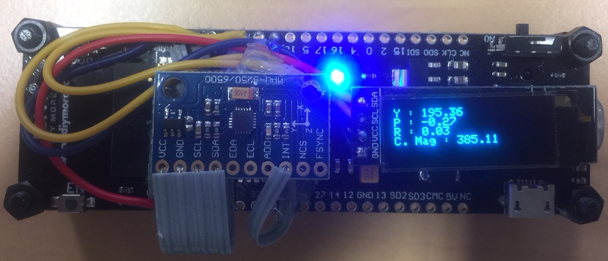

# AHRS

AHRS code for head-trackers

- BNO080 with ESP32 with bluetooth support (SPI link)
- MPU9250 + ESP32 with bluetooth support + OLED display (I2C link) - Based on K. Winner work
- BNO055 on Leaflab Maple stm32 board (+Nokia display)
- BNO055 on ESP32 
